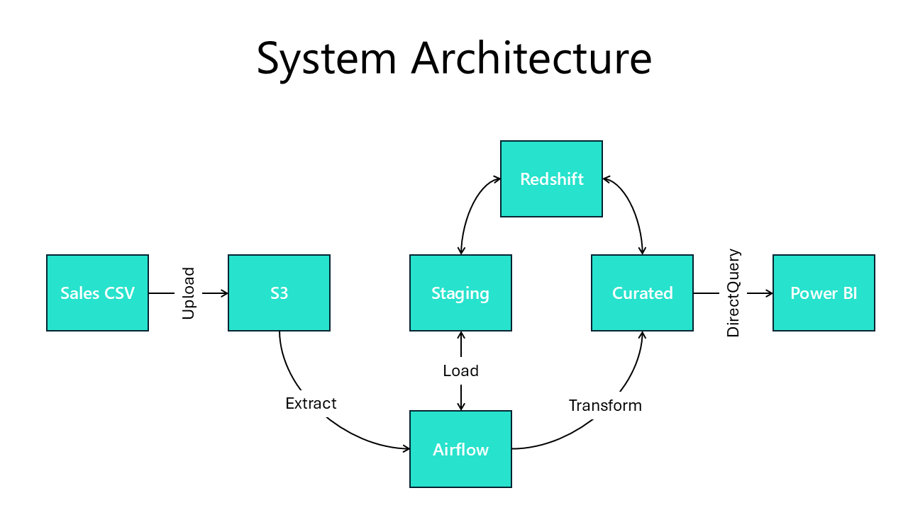
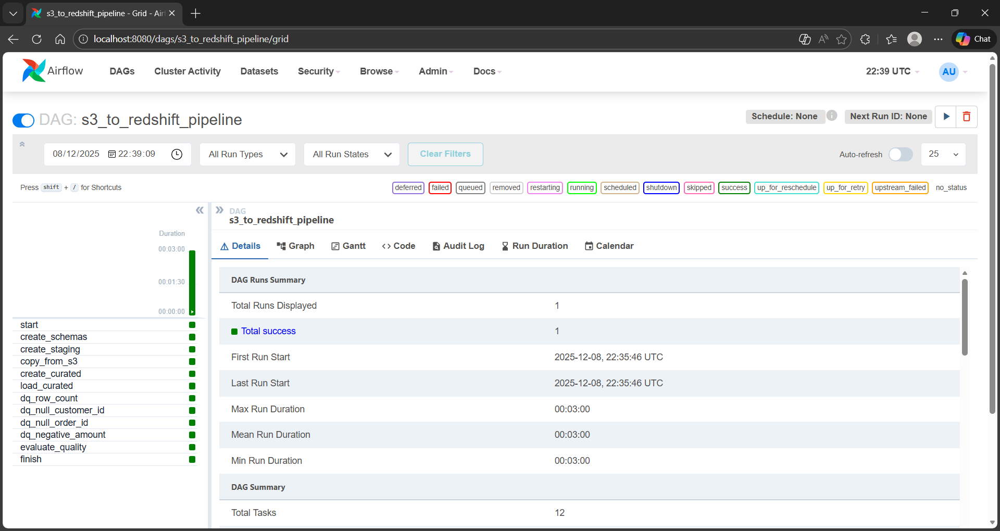
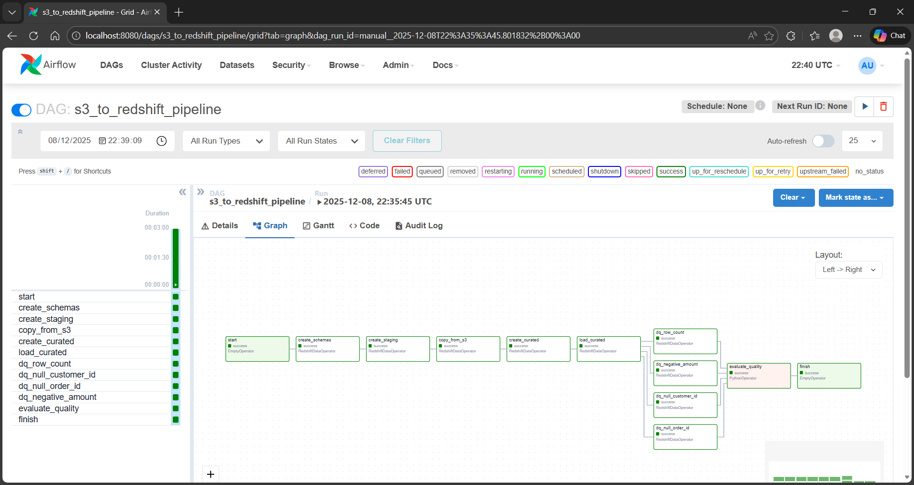
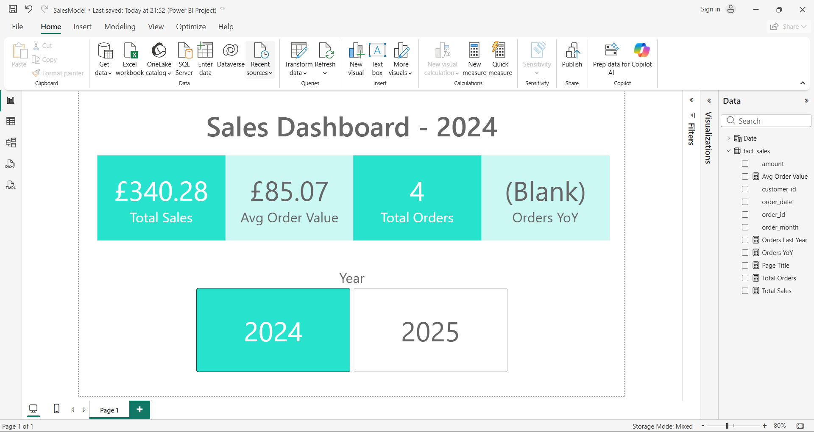
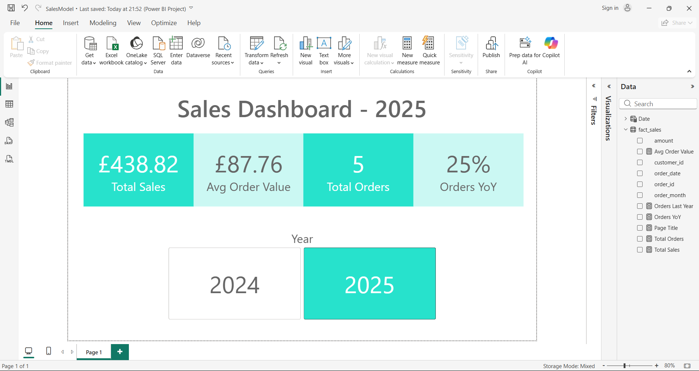

# S3 → Airflow → Redshift → Power BI — Report

Please find below the changes I performed to the Starter Template in order to fix the pipeline.

As Power BI Desktop requires Windows I have performed all of the steps using Windows 11.

I worked under the assumption that I had been handed a pipeline that the author believed to be fully working, and I have adopted a step-by-step approach to fix errors.

The pipline implements the following architecture:



## GitHub Actions

Imported code into a new GitHub repo

Checked GitHub Actions and found a failing action:

```bash
0s
Run black --check airflow/dags
would reformat /home/runner/work/s3-airflow-redshift-powerbi-starter/s3-airflow-redshift-powerbi-starter/airflow/dags/s3_to_redshift_pipeline.py

Oh no! 💥 💔 💥
1 file would be reformatted.
Error: Process completed with exit code 1.
```

Reformatted the file and commited the change:

```bash
uvx black airflow/dags
reformatted C:\Users\marge\Code\s3-airflow-redshift-powerbi-starter\airflow\dags\s3_to_redshift_pipeline.py

All done! ✨ 🍰 ✨
1 file reformatted.
```

GitHub Actions fails with a different error:

```bash
Run flake8 airflow/dags
airflow/dags/s3_to_redshift_pipeline.py:6:80: E501 line too long (85 > 79 characters)
```

Reformatted the DAG files with a maximum line length of 79:

```bash
uvx black --line-length 79 airflow/dags
reformatted C:\Users\marge\Code\s3-airflow-redshift-powerbi-starter\airflow\dags\s3_to_redshift_pipeline.py

All done! ✨ 🍰 ✨
1 file reformatted.
```

Add `--line-length 79` to the black step in `ci.yml` then committed and pushed the changes.

The GitHub Actions job still fails:

```bash
Run python - <<'PY'
Traceback (most recent call last):
  File "<stdin>", line 5, in <module>
  File "<frozen importlib._bootstrap_external>", line 883, in exec_module
  File "<frozen importlib._bootstrap>", line 241, in _call_with_frames_removed
  File "/home/runner/work/s3-airflow-redshift-powerbi-starter/s3-airflow-redshift-powerbi-starter/airflow/dags/s3_to_redshift_pipeline.py", line 3, in <module>
    from airflow import DAG
ImportError: cannot import name 'DAG' from 'airflow' (unknown location)
```

It looks like `apache-airflow` is missing from the dependencies. Test locally whether `from airflow import DAG` is valid.

Create a virtual environment:

```bash
uv venv .venv
```

Activate it:

```bash
.\.venv\Scripts\activate
```

Install airflow

```bash
uv pip install apache-airflow
```

Test import statement

```bash
python -c "from airflow import DAG"
```

This works fine. Add the dependency to `ci.yml`

Next error:

```bash
ModuleNotFoundError: No module named 'airflow.providers.amazon'
```

Add the `apache-airflow-providers-amazon` dependency, commit and push

Now the `ci.yml` workflow passes

## Terraform

Error running `terraform init`

```bash
terraform init
Initializing the backend...
╷
│ Error: Terraform encountered problems during initialisation, including problems
│ with the configuration, described below.
│
│ The Terraform configuration must be valid before initialization so that
│ Terraform can determine which modules and providers need to be installed.
│
│
╵
╷
│ Error: Invalid single-argument block definition
│
│   on variables.tf line 3, in variable "region":
│    3: variable "region"  { type = string  default = "eu-west-2" }
│
│ A single-line block definition must end with a closing brace immediately after its single argument definition.
```

Change the `region` variable definition to:

```bash
variable "region"  {
    type = string 
    default = "eu-west-2"
}
```

Now `terraform init` runs successfully.

`terraform apply` appears to work.

`terraform show` output (my account number has been redacted):

```
# data.aws_iam_policy_document.redshift_trust:
data "aws_iam_policy_document" "redshift_trust" {
    id            = "277058087"
    json          = jsonencode(
        {
            Statement = [
                {
                    Action    = "sts:AssumeRole"
                    Effect    = "Allow"
                    Principal = {
                        Service = "redshift.amazonaws.com"
                    }
                },
            ]
            Version   = "2012-10-17"
        }
    )
    minified_json = jsonencode(
        {
            Statement = [
                {
                    Action    = "sts:AssumeRole"
                    Effect    = "Allow"
                    Principal = {
                        Service = "redshift.amazonaws.com"
                    }
                },
            ]
            Version   = "2012-10-17"
        }
    )
    version       = "2012-10-17"

    statement {
        actions       = [
            "sts:AssumeRole",
        ]
        effect        = "Allow"
        not_actions   = []
        not_resources = []
        resources     = []
        sid           = null

        principals {
            identifiers = [
                "redshift.amazonaws.com",
            ]
            type        = "Service"
        }
    }
}

# data.aws_iam_policy_document.s3_policy:
data "aws_iam_policy_document" "s3_policy" {
    id            = "1206446763"
    json          = jsonencode(
        {
            Statement = [
                {
                    Action   = [
                        "s3:ListBucket",
                        "s3:GetObject",
                    ]
                    Effect   = "Allow"
                    Resource = [
                        "arn:aws:s3:::pre-assessment-raw-a7538041/*",
                        "arn:aws:s3:::pre-assessment-raw-a7538041",
                    ]
                },
            ]
            Version   = "2012-10-17"
        }
    )
    minified_json = jsonencode(
        {
            Statement = [
                {
                    Action   = [
                        "s3:ListBucket",
                        "s3:GetObject",
                    ]
                    Effect   = "Allow"
                    Resource = [
                        "arn:aws:s3:::pre-assessment-raw-a7538041/*",
                        "arn:aws:s3:::pre-assessment-raw-a7538041",
                    ]
                },
            ]
            Version   = "2012-10-17"
        }
    )
    version       = "2012-10-17"

    statement {
        actions       = [
            "s3:GetObject",
            "s3:ListBucket",
        ]
        effect        = "Allow"
        not_actions   = []
        not_resources = []
        resources     = [
            "arn:aws:s3:::pre-assessment-raw-a7538041",
            "arn:aws:s3:::pre-assessment-raw-a7538041/*",
        ]
        sid           = null
    }
}

# aws_iam_role.redshift_load:
resource "aws_iam_role" "redshift_load" {
    arn                   = "arn:aws:iam::<redacted>:role/pre-assessment-redshift-load"
    assume_role_policy    = jsonencode(
        {
            Statement = [
                {
                    Action    = "sts:AssumeRole"
                    Effect    = "Allow"
                    Principal = {
                        Service = "redshift.amazonaws.com"
                    }
                },
            ]
            Version   = "2012-10-17"
        }
    )
    create_date           = "2025-12-06T23:00:50Z"
    description           = null
    force_detach_policies = false
    id                    = "pre-assessment-redshift-load"
    managed_policy_arns   = []
    max_session_duration  = 3600
    name                  = "pre-assessment-redshift-load"
    name_prefix           = null
    path                  = "/"
    permissions_boundary  = null
    tags                  = {}
    tags_all              = {}
    unique_id             = "AROAZR6UPHQSQDD6AAXQ7"

    inline_policy {
        name   = "terraform-20251206230044977300000001"
        policy = jsonencode(
            {
                Statement = [
                    {
                        Action   = [
                            "s3:ListBucket",
                            "s3:GetObject",
                        ]
                        Effect   = "Allow"
                        Resource = [
                            "arn:aws:s3:::pre-assessment-raw-a7538041/*",
                            "arn:aws:s3:::pre-assessment-raw-a7538041",
                        ]
                    },
                ]
                Version   = "2012-10-17"
            }
        )
    }
}

# aws_iam_role_policy.s3_access:
resource "aws_iam_role_policy" "s3_access" {
    id          = "pre-assessment-redshift-load:terraform-20251206230044977300000001"
    name        = "terraform-20251206230044977300000001"
    name_prefix = "terraform-"
    policy      = jsonencode(
        {
            Statement = [
                {
                    Action   = [
                        "s3:ListBucket",
                        "s3:GetObject",
                    ]
                    Effect   = "Allow"
                    Resource = [
                        "arn:aws:s3:::pre-assessment-raw-a7538041/*",
                        "arn:aws:s3:::pre-assessment-raw-a7538041",
                    ]
                },
            ]
            Version   = "2012-10-17"
        }
    )
    role        = "pre-assessment-redshift-load"
}

# aws_redshiftserverless_namespace.ns:
resource "aws_redshiftserverless_namespace" "ns" {
    admin_password_secret_arn        = null
    admin_password_secret_kms_key_id = null
    admin_user_password_wo           = (write-only attribute)
    admin_username                   = (sensitive value)
    arn                              = "arn:aws:redshift-serverless:eu-west-2:<redacted>:namespace/55596d44-e673-4c6f-8bb5-ad56b01fe53a"
    db_name                          = "analytics"
    default_iam_role_arn             = null
    iam_roles                        = [
        "arn:aws:iam::<redacted>:role/pre-assessment-redshift-load",
    ]
    id                               = "pre-assessment-ns"
    kms_key_id                       = "AWS_OWNED_KMS_KEY"
    log_exports                      = []
    namespace_id                     = "55596d44-e673-4c6f-8bb5-ad56b01fe53a"
    namespace_name                   = "pre-assessment-ns"
    tags                             = {}
    tags_all                         = {}
}

# aws_redshiftserverless_workgroup.wg:
resource "aws_redshiftserverless_workgroup" "wg" {
    arn                  = "arn:aws:redshift-serverless:eu-west-2:<redacted>:workgroup/76fddf41-8b9a-4645-8d65-fcc6573cd146"
    base_capacity        = 8
    endpoint             = [
        {
            address      = "pre-assessment-wg.<redacted>.eu-west-2.redshift-serverless.amazonaws.com"
            port         = 5439
            vpc_endpoint = [
                {
                    network_interface = [
                        {
                            availability_zone    = "eu-west-2a"
                            network_interface_id = "eni-059b29135630bc659"
                            private_ip_address   = "172.31.25.96"
                            subnet_id            = "subnet-0141fe0b320e82573"
                        },
                        {
                            availability_zone    = "eu-west-2c"
                            network_interface_id = "eni-07e20fa7ae421616c"
                            private_ip_address   = "172.31.12.110"
                            subnet_id            = "subnet-05520d2e06ac426ae"
                        },
                        {
                            availability_zone    = "eu-west-2b"
                            network_interface_id = "eni-0d91150b00a1a2786"
                            private_ip_address   = "172.31.47.73"
                            subnet_id            = "subnet-0fe1f344816af90b0"
                        },
                    ]
                    vpc_endpoint_id   = "vpce-0409c4934a04fb708"
                    vpc_id            = "vpc-0974035089f23b351"
                },
            ]
        },
    ]
    enhanced_vpc_routing = false
    id                   = "pre-assessment-wg"
    max_capacity         = 0
    namespace_name       = "pre-assessment-ns"
    port                 = 5439
    publicly_accessible  = true
    security_group_ids   = [
        "sg-0f59f7897334d3527",
    ]
    subnet_ids           = [
        "subnet-0141fe0b320e82573",
        "subnet-05520d2e06ac426ae",
        "subnet-0fe1f344816af90b0",
    ]
    tags                 = {}
    tags_all             = {}
    track_name           = "current"
    workgroup_id         = "76fddf41-8b9a-4645-8d65-fcc6573cd146"
    workgroup_name       = "pre-assessment-wg"

    config_parameter {
        parameter_key   = "auto_mv"
        parameter_value = "true"
    }
    config_parameter {
        parameter_key   = "datestyle"
        parameter_value = "ISO, MDY"
    }
    config_parameter {
        parameter_key   = "enable_case_sensitive_identifier"
        parameter_value = "false"
    }
    config_parameter {
        parameter_key   = "enable_user_activity_logging"
        parameter_value = "true"
    }
    config_parameter {
        parameter_key   = "max_query_execution_time"
        parameter_value = "14400"
    }
    config_parameter {
        parameter_key   = "query_group"
        parameter_value = "default"
    }
    config_parameter {
        parameter_key   = "require_ssl"
        parameter_value = "true"
    }
    config_parameter {
        parameter_key   = "search_path"
        parameter_value = "$user, public"
    }
    config_parameter {
        parameter_key   = "use_fips_ssl"
        parameter_value = "false"
    }

    price_performance_target {
        enabled = false
        level   = 0
    }
}

# aws_s3_bucket.raw:
resource "aws_s3_bucket" "raw" {
    acceleration_status         = null
    arn                         = "arn:aws:s3:::pre-assessment-raw-a7538041"
    bucket                      = "pre-assessment-raw-a7538041"
    bucket_domain_name          = "pre-assessment-raw-a7538041.s3.amazonaws.com"
    bucket_prefix               = null
    bucket_regional_domain_name = "pre-assessment-raw-a7538041.s3.eu-west-2.amazonaws.com"
    force_destroy               = false
    hosted_zone_id              = "Z3GKZC51ZF0DB4"
    id                          = "pre-assessment-raw-a7538041"
    object_lock_enabled         = false
    policy                      = null
    region                      = "eu-west-2"
    request_payer               = "BucketOwner"
    tags                        = {}
    tags_all                    = {}

    grant {
        id          = "58ad492c414dda9bd2cd1e3fcf19904f08c7e1b77fa2ae59fb78e232fa014128"
        permissions = [
            "FULL_CONTROL",
        ]
        type        = "CanonicalUser"
        uri         = null
    }

    server_side_encryption_configuration {
        rule {
            bucket_key_enabled = false

            apply_server_side_encryption_by_default {
                kms_master_key_id = null
                sse_algorithm     = "AES256"
            }
        }
    }

    versioning {
        enabled    = false
        mfa_delete = false
    }
}

# random_id.suffix:
resource "random_id" "suffix" {
    b64_std     = "p1OAQQ=="
    b64_url     = "p1OAQQ"
    byte_length = 4
    dec         = "2807267393"
    hex         = "a7538041"
    id          = "p1OAQQ"
}


Outputs:

iam_role_arn = "arn:aws:iam::<redacted>:role/pre-assessment-redshift-load"
redshift_workgroup_name = "pre-assessment-wg"
s3_bucket_name = "pre-assessment-raw-a7538041"
```

## Airflow

I made extensive updates to the Airflow `docker-compose.yaml` configuration after observing problems starting the containers.

* I decided to stay with SQLite for this task for ease of deployment
* Set `AIRFLOW__CORE__EXECUTOR` to the SQLite compatible `"SequentialExecutor"` option
* Added shared database volume
* Added `init-perms` container to `chown` the database directory (airflow runs as non-root and cannot perform this task)
* Added `airflow-init` container to initialise the database and user accounts. This waits for `init-perms` to complete
* Split Airflow into webserver and scheduler containers. Both wait the `airflow-init` to finish before starting

### Pipeline fixes

I made several fixes to the data ingest pipeline.

* Following data import best practices the staging table now imports all values as `VARCHAR`
* Applies data types and performs some basic validation when importing into the curated table in the `load_curated` step
* Performs data quality checks for row count, null order id, null customer id, and negative values in the amount field
* The data quality checks would run in parallel when not using `SequentialExecutor`
* I removed an inital blank line in the example CSV file

After performing fixes the pipeline ran successfully:





## Power BI

When configuring Power BI to access Redshift Serverless I found that I had to add the `iam_roles` and `publicly_accessible` stanzas below:

```
# Redshift Serverless
resource "aws_redshiftserverless_namespace" "ns" {
  namespace_name = "${var.project}-ns"
  db_name        = "analytics"
  iam_roles      = [aws_iam_role.redshift_load.arn]
}

resource "aws_redshiftserverless_workgroup" "wg" {
  workgroup_name      = "${var.project}-wg"
  namespace_name      = aws_redshiftserverless_namespace.ns.namespace_name
  base_capacity       = 8
  publicly_accessible = true
}
```

I **would not** normally make a database publicly accessible like this. It contains no customer data, and a fully secure solution would exceed the time I have available for this task.

I noticed that the sample data did not include any 2024 data, so this Measure example divides by zero:

```
Orders YoY =
VAR CurrentYear = YEAR(MAX('fact_sales'[order_date]))
VAR LastYear = CurrentYear - 1
VAR OrdersCurrent = COUNTROWS(FILTER('fact_sales', YEAR('fact_sales'[order_date]) = CurrentYear))
VAR OrdersLast    = COUNTROWS(FILTER('fact_sales', YEAR('fact_sales'[order_date]) = LastYear))
RETURN DIVIDE(OrdersCurrent - OrdersLast, OrdersLast)
```

I added some more data to the example CSV, re-uploaded to S3 and re-ran the Airflow import job.

Below are screenshots of my Power BI report. The user can click on the 2024 or 2025 buttons to select data for the appropriate year. You can see the Measures I added on the right of the screenshots


